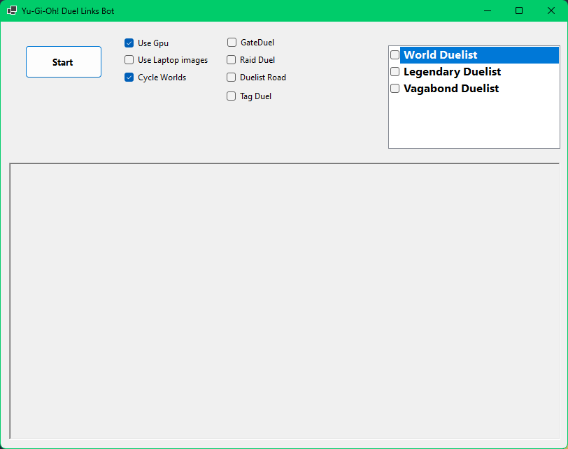

# Project Overview

This project is a machine learning-based automation tool for Yu-Gi-Oh! Duel Links. It utilizes computer vision and machine learning algorithms to detect and interact with game elements, allowing for automated gameplay and tasks. The project is built using C# and .NET, and leverages libraries such as Emgu.CV and Microsoft.ML for image processing and machine learning capabilities.

## Local Setup

Change images in **src\BotLogic\Images** those are used with **Emgu.CV** because the model isn't the best and misses those objects. So they should match your playing resolution.

## Options Explanations

- **Use GPU**: Are you going to use your GPU or CPU for ML processing?
  - For this to work, you have to have a CUDA-compatible GPU.
  - If the hardware is supported, it's recommended to turn it on since it's faster than CPU.

- **Use Laptop Images**: Are you going to use alternative images?
  - I used this for running on my laptop with alternative images.
  - Alternative images have a **_lap** suffix.

- **Cycle World**: Do you want to switch to the next world after the first one is done?
  - This option goes through worlds and, after making sure the current one is empty, will switch to the next one.

- **Event Options**: Select only one.
  - ***Gate Duel*** - For duel events where you duel at the gate, start by selecting the screen with the gate and character to duel (it only works with event one since only they have an auto-duel button).
  - ***Raid Duel*** - For Raid Duel events, enter the Raid duel page before starting the bot.
  - ***Duelist Road*** - For Duelist Road events, enter the Duelist Road event page before starting the bot.
  - ***Tag Duel*** - For Tag Duel events, enter the Tag duel page before starting the bot.

## Additional Information

The ML model isn't great because it was trained on a relatively low number of images and also combined mobile and PC game layouts before I found out I couldn't root my spare phone to have this running there. So, this is why there is a combination with OpenCV to get this to work. Also, I've stopped playing Duel Links, but I see that there is a new game layout. This will not work with that since it's trained on the old one. You need to change it to the old one if it's possible. There are some additional tags that I have in the model but never cared to implement in the bot. You can find them in the [vott file](Duelists-export.json).
